# Project 2 - LEMP Stack Deployment

**Step 0 - Prerequisites**
---

- Created new AWS instance.

- Installed Git Bash.

    - Ran `ssh -i <Your-private-key.pem> ubuntu@<EC2-Public-IP-address>` to ssh using Git Bash instead of Putty. See result below:

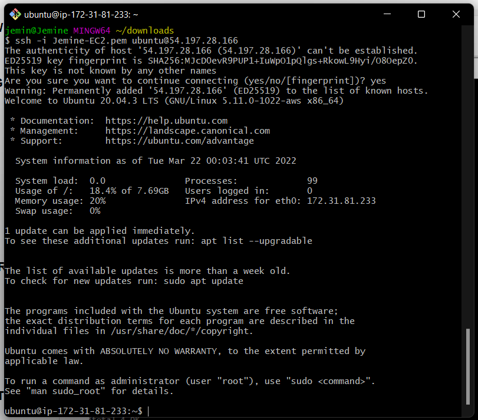

**Step 1 - Installing the Nginx web server**
---

- Ran `sudo apt update` to update package manager. Also ran `sudo apt install nginx` to install nginx on linux server.

    - Ran `sudo systemctl status nginx` to confirm if nginx was fully installed and working. See result below:

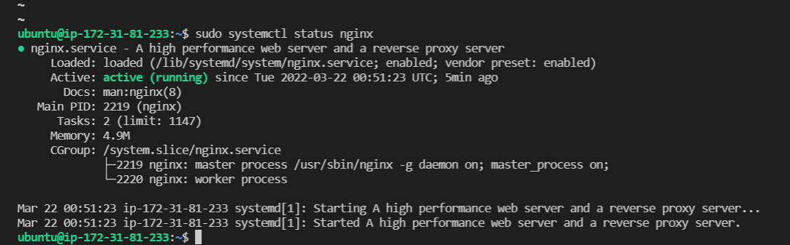

- Configured NSG to allow inbound connections on port 80. See screenshot below:

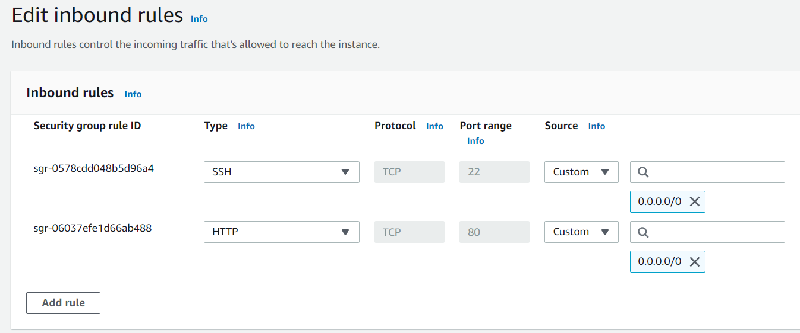

- Ran a curl `curl http://127.0.0.1:80` to confirm if the web server could be accessed. See result below:

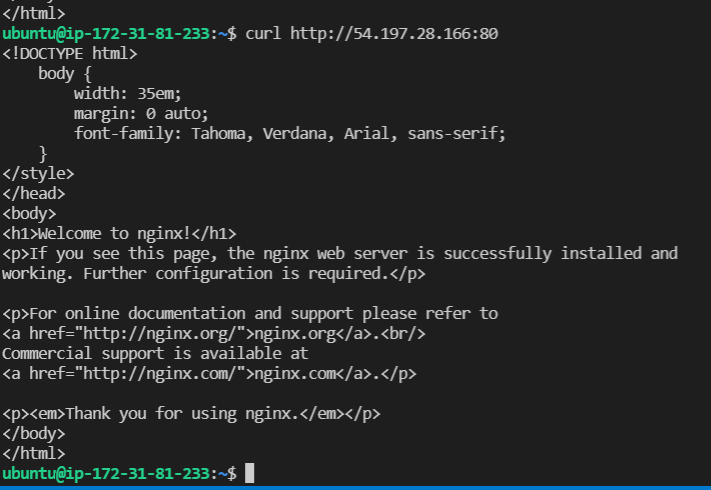

- Tried accessing the web server from a brower using the public IP. The result was a welcome to nginx screen as seen below:


**Step 2 - Installing MySQL**
---

- Ran `sudo apt install mysql-server` to install MySQL server on linux server. Installation was successful.

    - Ran the `sudo mysql_secure_installation` to perform the secure installation of MySQL and remove some insure default settings. Opted for a password of MEDIUM strength.

    - Ran `sudo mysql` to check if MySQL was installed properly and if I'm able to log in. Output shows installation was sucessful.
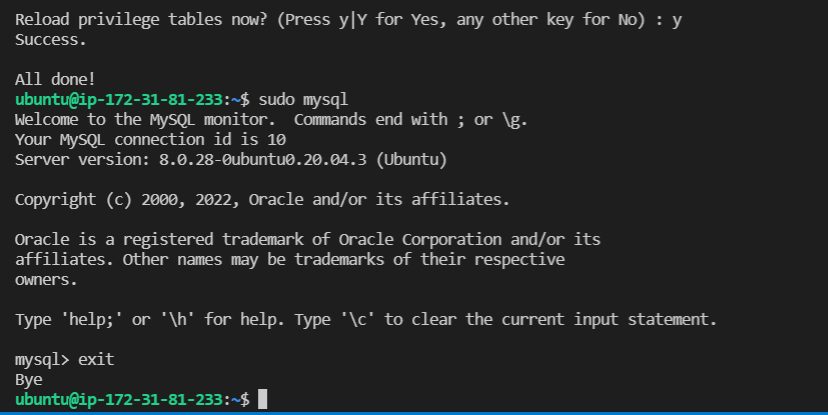
    - Used the `exit` command to exit MySQL.

**Step 3 - Installing PHP**
---

- Ran `sudo apt install php-fpm php-mysql` to install PHP & PHP fast CGI process manager. Installation successful as seen below:
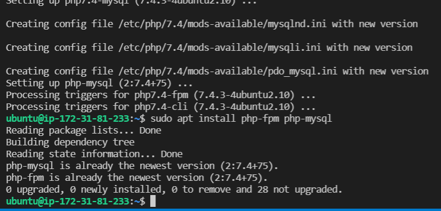

**Step 4 - Configuring Nginx to use PHP processor**
---

- Ran `sudo mkdir /var/www/projectLEMP` to create a web directory for my domain projectLEMP. Since nginx has one enabled by default, it is recommended we create another.
    - Also ran `sudo chown -R $USER:$USER /var/www/projectLEMP` to assign ownership of the directory to the current system user.
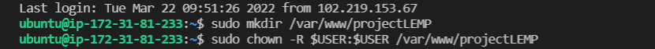

- Ran `sudo nano /etc/nginx/sites-available/projectLEMP` to create a configuration file in the web directory using the `nano` editor. Prior to this project, `VIM` has been the go to editor.

    - Pasted in the following bare-bones configuration using the `nano` editor.

    ```
    #/etc/nginx/sites-available/projectLEMP

    server {
    listen 80;
    server_name projectLEMP www.projectLEMP;
    root /var/www/projectLEMP;

    index index.html index.htm index.php;

    location / {
        try_files $uri $uri/ =404;
    }

    location ~ \.php$ {
        include snippets/fastcgi-php.conf;
        fastcgi_pass unix:/var/run/php/php7.4-fpm.sock;
     }

    location ~ /\.ht {
        deny all;
    }

    }
    ```

    - Saved the configuration using `CTRL + X`. See config file in screenshot below.
    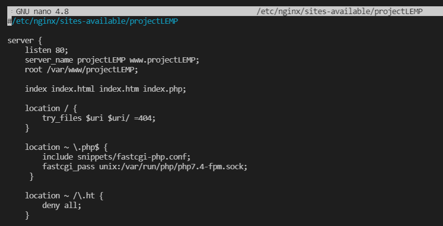

- Ran `sudo ln -s /etc/nginx/sites-available/projectLEMP /etc/nginx/sites-enabled/` to activate config by linking the config file from nginx `sites-available dir.

    - Ran `sudo nginx -t` to check for syntax errors.
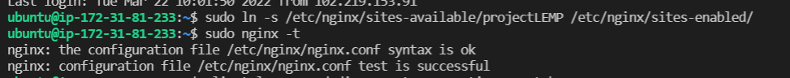

- Ran `sudo unlink /etc/nginx/sites-enabled/default` to disable/unlink default nginx host listening on port 80.

    - Reloaded nginx to apply changes by running `sudo systemctl reload nginx`.
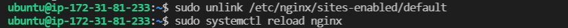

- Created `index.html` file in `/vaw/www/projectLEMP/` dir to test if server block/virtual host is up and running. Used `sudo echo 'Hello LEMP from hostname' $(curl -s http://169.254.169.254/latest/meta-data/public-hostname) 'with public IP' $(curl -s http://169.254.169.254/latest/meta-data/public-ipv4) > /var/www/projectLEMP/index.html` to create and file and perform config.

    - Checked via public IPV4 on my broswer:
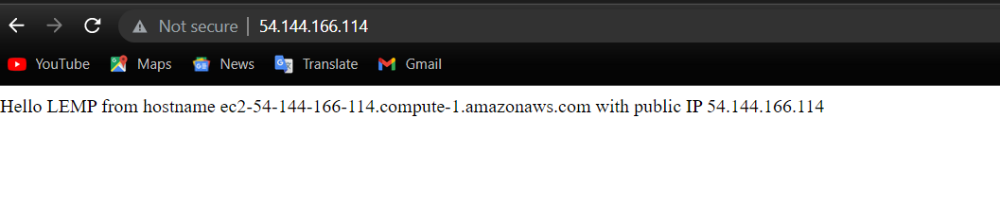

    - Checked via public DNS on my browser:
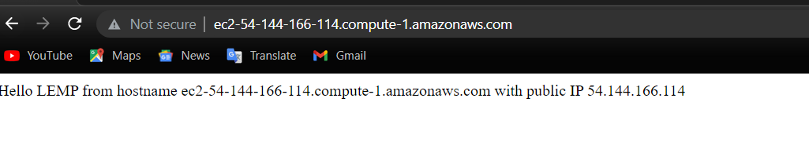

    - Edit test index.html file with randomly generated code, save config and reload nginx. After this has been done, check the browser using the public IP and port.


**Step 5 - Testing PHP with nginx**
---

- In order to validate that nginx can properly hand .php files to the PHP processor, I created a test php file in the document root (projectLAMP) folder using `sudo nano /var/www/projectLEMP/info.php`

    - Pasted in this simple config for the php file.
    ```
    <?php
    phpinfo();
    ```
    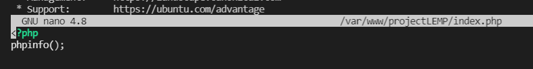

- After saving the index.php file, I used my browser to see if the page is up and running by running ``http://`server_domain_or_IP`/index.php``. Page is working great! See result below:


- Ran `sudo rm /var/www/your_domain/index.php` to remove php page after confirmation. This is done as the php page displays sensitive information about the PHP environment and ubuntu server.
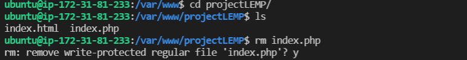

**Step 6 - Retrieving data from MySQL database with PHP**
---

- Connected to MySQL using the root account by running `sudo mysql`.
    - Created a new database in MySQL by running ``mysql> CREATE DATABASE `example_database`;``
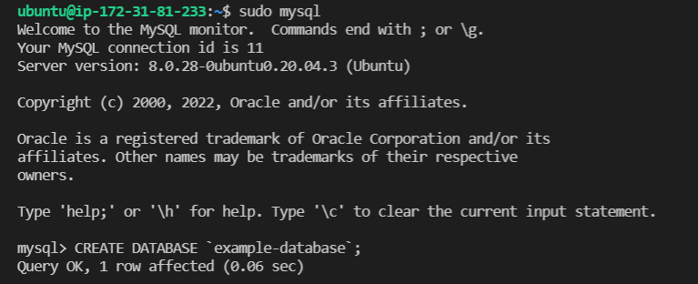

- Ran `CREATE USER 'example_user'@'%' IDENTIFIED WITH mysql_native_password BY 'password';` to create a new user and set the default authentication mode as mysql_native_password.

    - Used `GRANT ALL ON example_database.* TO 'example_user'@'%';` to assign the created user `example_user` full rights over the created database `example_database`, while limiting them from creating or modifying other databases on the server.
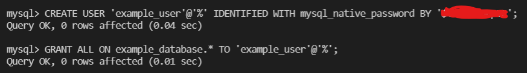

    - Exit the SQL shell and ran `mysql -u example_user -p` to login with the just created account `example_user` to test the access. Logged in successfully.

- Inside the MySQL shell, run `SHOW DATABASES;` to show the list of databases.


- Created a test table called `todo_list` from the MySQL console. Ran `CREATE TABLE example_database.todo_list (item_id INT AUTO_INCREMENT, content VARCHAR(255), PRIMARY KEY(item_id));`

    - Ran `INSERT INTO example_database.todo_list (content) VALUES ("My first important item");` to insert rows of data into the test table. Repeated until there was enough.

    - Ran `SELECT * FROM example_database.todo_list;` to confirm that data entered was saved to the table. Save was successful. Exited the SQL console after. See below report.

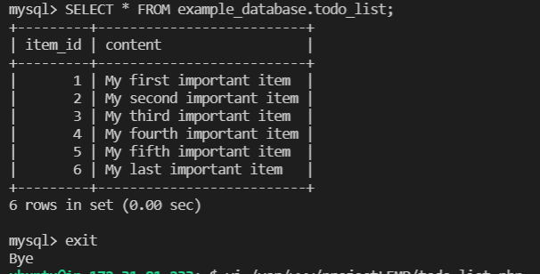

- Ran `vi /var/www/projectLEMP/todo_list.php` to create a new php file in the web root directory. The `todo_list.php` script will connect to MySQL and query for content.
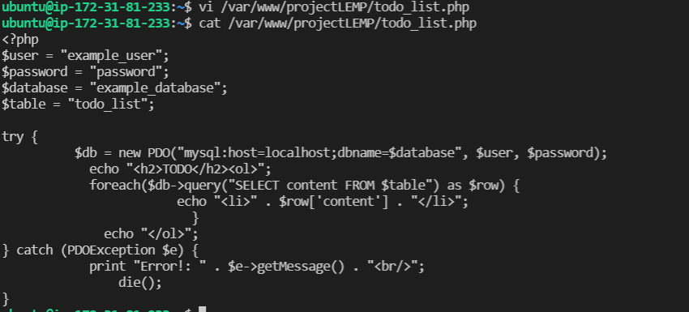

- Checked `http://<Public_domain_or_IP>/todo_list.php` on my browser to confirm if everything is working as expected and it was. See screenshot below:

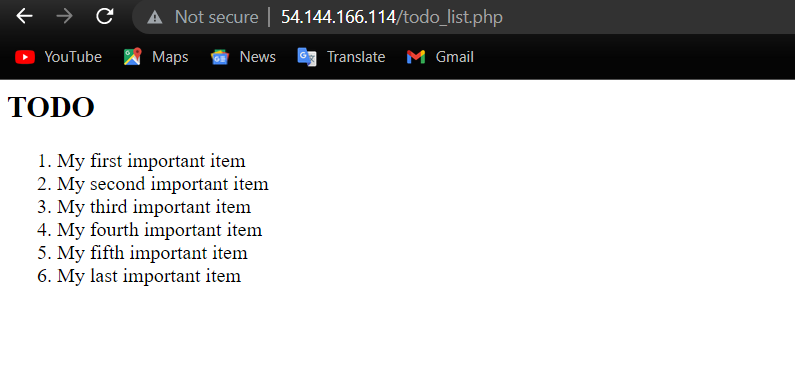

**LEMP Stack successfully deployed**


